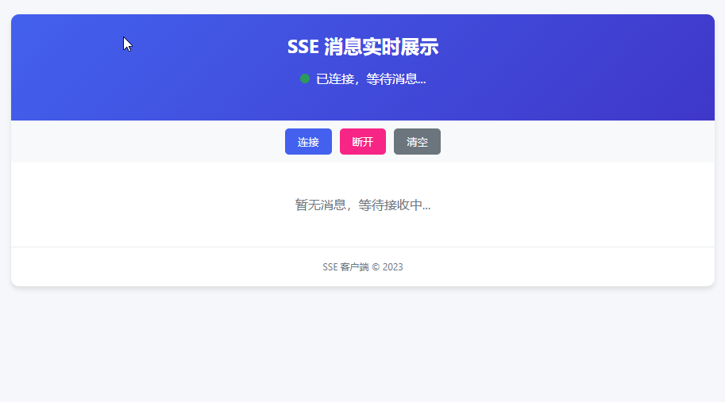
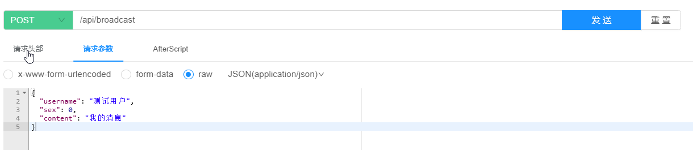
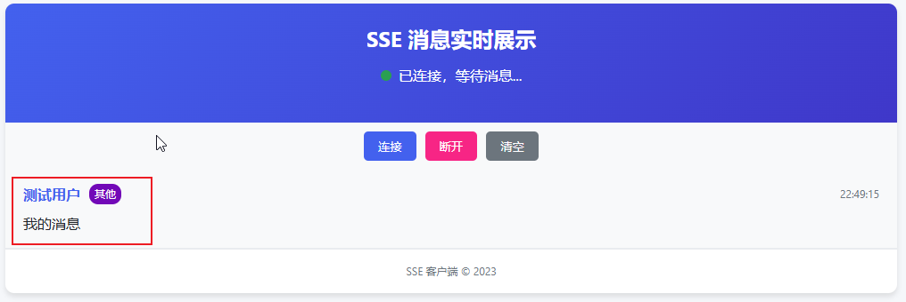

## 🎄介绍

本项目基于SpringBoot2.0+的SSE轻量级广播消息实现，支持多用户同时在线接收消息，项目地址。适用于报警、推送硬件指标等少量消息推送场景，30s定时检测一次客户端连接状况，定期清理关闭连接的客户端。

本项目设计简单非常适合当定制开发，和当成组件集成进别的项目中。

SSE 是单向通道，只能服务器向浏览器发送，因为流信息本质上就是下载。

> sse优势

1. 无需额外协议，兼容现有 HTTP 基础设施。 
2. 客户端内置重连机制。
3. 客户端使用标准 EventSource API，服务端只需返回 text/event-stream。
4. 比 WebSocket 更节省资源。

## 🎃例子

1. 引入依赖启动项目。
2. 使用浏览器打开test.html文件，默认订阅了sse，并等待消息，如下图所示。



3. 打开接口文档http://localhost:8080/api/doc.html#/default/broadcast-controller/broadcastMessage，发送消息和客户端接收如下图。





4. 客户端关闭连接后，后端服务定时30s检测一次，并释放资源。

## 🎉核心代码

>  后端

```java
@RestController
@RequestMapping("/sse")
@Slf4j
public class SseServer {
    // 保存所有连接的客户端
    private static final List<SseEmitter> emitters = new Vector<>();

    /**
     * 客户端订阅 SSE
     */
    @GetMapping(path = "/subscribe", produces = MediaType.TEXT_EVENT_STREAM_VALUE)
    public SseEmitter subscribe() {
        SseEmitter emitter = new SseEmitter(0L); // 0表示不超时

        // 添加 emitter 到列表
        emitters.add(emitter);
        log.info("客户端连接成功，当前连接数：{}", emitters.size());
        // 退出回调函数
        emitter.onCompletion(() -> {
            emitters.remove(emitter);
            log.info("客户端断开连接，当前连接数：{}", emitters.size());
        });
        emitter.onTimeout(() -> {
            emitter.complete(); // 关闭
            log.warn("连接超时关闭");
        });
        emitter.onError(ex -> {
            emitter.completeWithError(ex); // 异常关闭
            log.error("连接异常关闭: {}", ex.getMessage());
        });

        return emitter;
    }

    /**
     * 广播消息
     *
     * @param message
     */
    public void broadcast(String message) {
        Iterator<SseEmitter> iterator = emitters.iterator();
        while (iterator.hasNext()) {
            SseEmitter emitter = iterator.next();
            try {
                emitter.send(message);
            } catch (IOException e) {
                iterator.remove(); // 确保失效连接被移除
            }
        }
    }

    /**
     * 发送心跳检测客户端是否断开连接，30s一次
     */
    @Scheduled(fixedDelay = 30_000L)
    public void sseHeartbeat() {
        Iterator<SseEmitter> iterator = emitters.iterator();
        while (iterator.hasNext()) {
            SseEmitter emitter = iterator.next();
            // 发送心跳事件
            try {
                // 发送心跳事件（空消息，仅作为保活机制）
                emitter.send(SseEmitter.event()
                        .name("heartbeat")  // 事件类型设为 "heartbeat"
                        .data(""));          // 空数据
            } catch (IOException e) {
                // 发送失败可能是由于客户端断开连接，移除该 emitter
                iterator.remove(); // 确保失效连接被移除
            }
        }
    }
}
```

> 前端

```html
<!DOCTYPE html>
<html lang="zh">
<head>
    <meta charset="UTF-8">
    <title>sse-client</title>
</head>
<body>
<h2>sse-client</h2>
<script>
    // 建立连接
    let sse = new EventSource("http://localhost:8080/api/sse/subscribe");
    // 监听消息
    sse.onmessage = function (event) {
        let data = event.data;
        console.log(data);
    };
    // 释放连接
    // sse.close()
</script>
</body>
</html>
```

